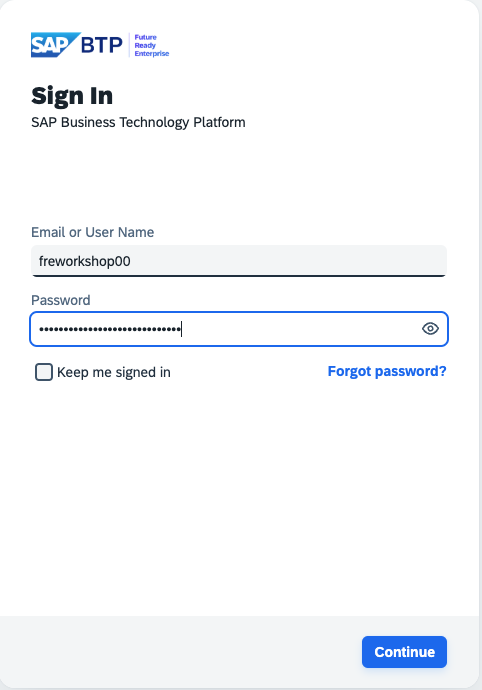
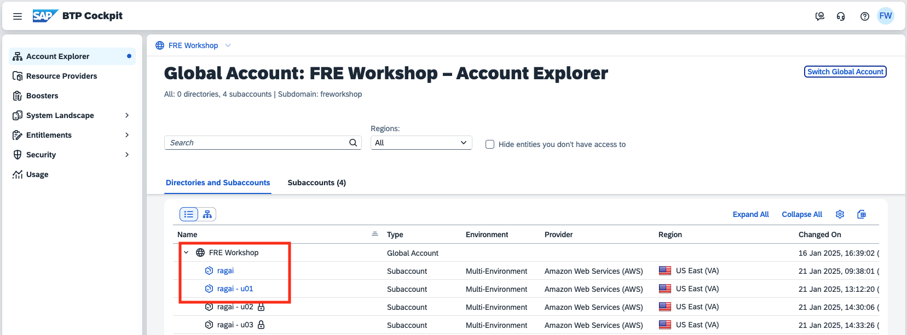

# Login to SAP BTP Cockpit

## Prerequisites
1. Google Chrome is strongly recommended.
2. Know your assigned username, for example, **freworkshop00** and associated password. These will be provided by the session lead.

## Steps

1. Launch the SAP BTP Cockpit by clicking on the following link [SAP BTP Cockpit](https://amer.cockpit.btp.cloud.sap/cockpit/?idp=freworkshop.accounts.ondemand.com).

2. Enter your assigned username and password then press **Continue**.

3. After a few seconds the SAP BTP Cockpit should display global account details.

4. You should see that you have access to two subaccounts.
* **ragai** is a shared subaccount with Generative AI Hub and SAP HANA Cloud 
* **ragai - u00** is the subaccount you will use to deploy the RAG application (the last two digits will correspond to your assigned username)

5. Continue to the [next section](./02-ReviewGenAIHub.md).
