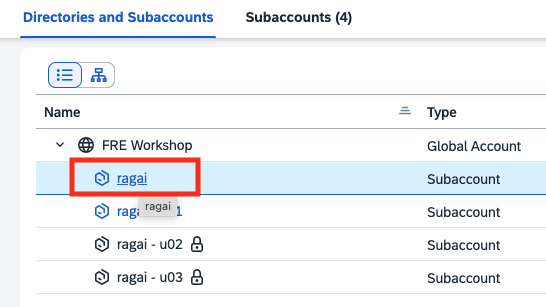
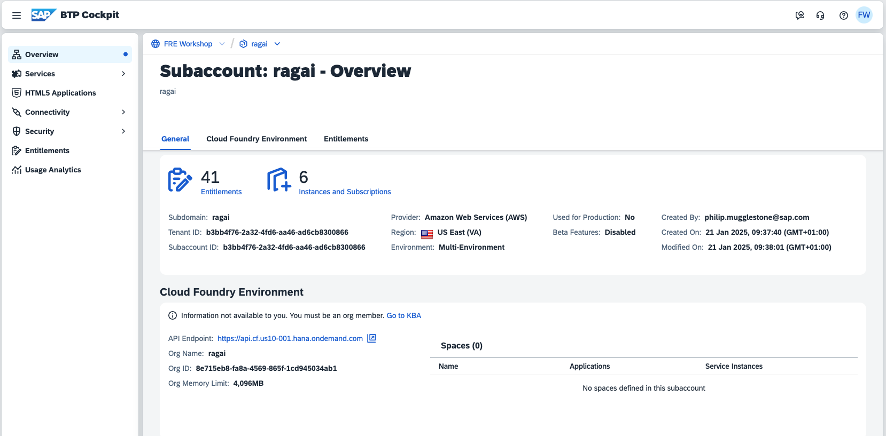
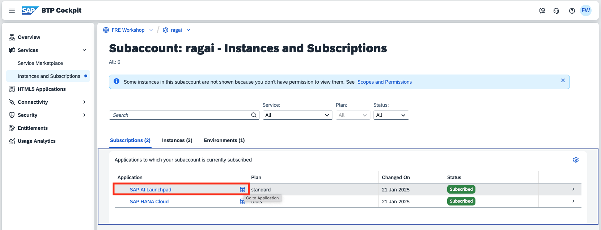
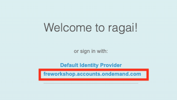
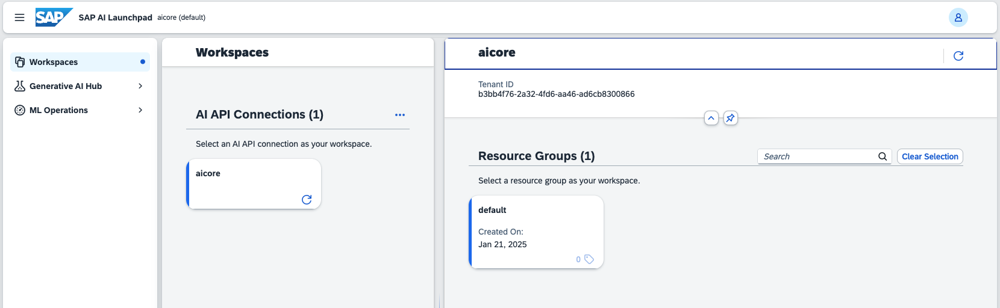
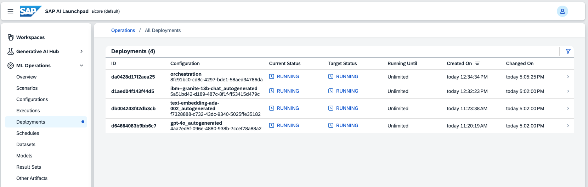
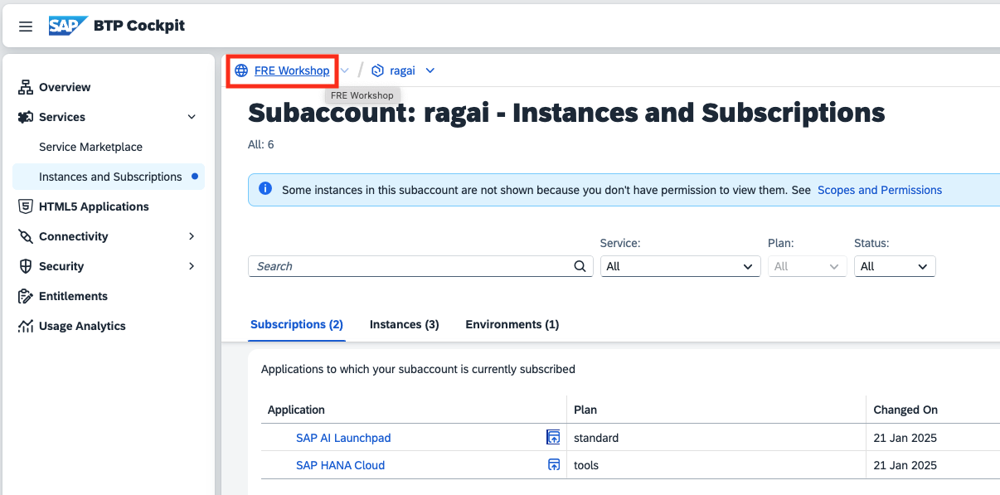

# Review Generative AI Hub

## Steps

1. From the global account view of the SAP BTP Cockpit, click on the link to open the **ragai** subaccount.

2. After a few seconds the SAP BTP Cockpit should display the subaccount details.

3. Click on **Services** then **Instances and Subscriptions** then click on the icon to open the **SAP AI Launchpad** application 

4. A new tab will open. When prompted, click on **freworkshop.accounts.sap.com** to sign in.

5. SAP AI Launchpad will be displayed

6. For now we're just interested to see what foundation models have already been deployed and what their respective deployment IDs are. Click on **ML Operations** then **Deployments**

7. Notice that deployments exist for
* **text-embedding-ada-002** Text Embedding model from OpenAI 
* **gpt-4o** Chat Completions Model from OpenAI
* **ibm--granite-13b-chat** Chat Completions Model from IBM

8. Optionally, bookmark this URL for easy access later.

9. Return to the global account view of the SAP BTP Cockpit by clicking on the **FRE Workshop** link.

10. Continue to the [next section](./03-BuildDeployApp.md).
