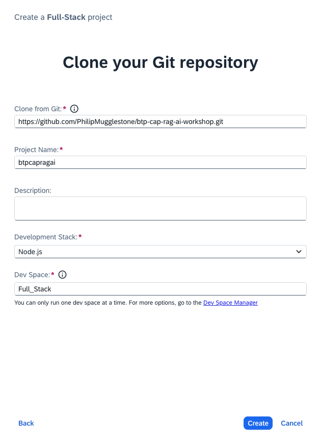
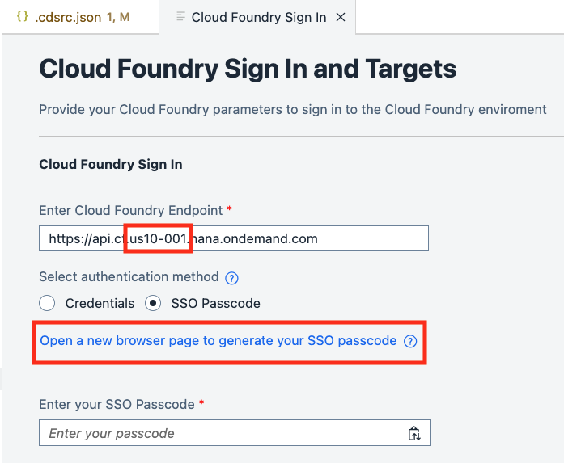
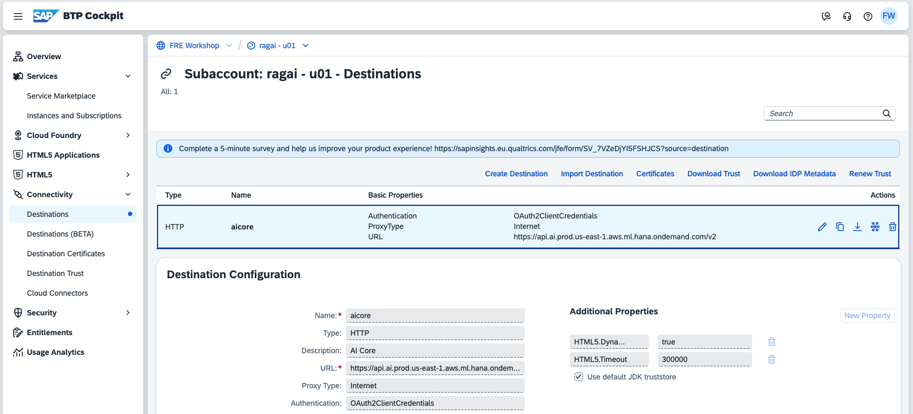

# Build & Deploy the RAG Application

## Steps

1. From the global account view of the SAP BTP Cockpit, click on the link to open your subaccount, for example, **ragai - u00**.


2. After a few seconds the SAP BTP Cockpit should display the subaccount details.


3. Click on **Services** then **Instances and Subscriptions** then click on the icon to open the **SAP Build Code** application.


4. A new tab will open. When prompted, click on **freworkshop.accounts.sap.com** to sign in.


5. SAP Build Lobby will be displayed. Optionally, bookmark this URL for easy access later.


6. Click on **Create** to create a new application and select **Clone from Git** from the sub menu.


7. Click on the **Full-Stack Application** tile.


8. Configure the new app as follows and then press **Create**.
* Repository URL: [btp-cap-rag-ai-workshop](https://github.com/PhilipMugglestone/btp-cap-rag-ai-workshop.git)

```
https://github.com/PhilipMugglestone/btp-cap-rag-ai-workshop.git
```
* Project Name: **btpcapragai** 



9. After some time SAP Build Code will launch. Click on the **Explorer** icon in the side bar to see the project folders.


10. Let's review some of the key aspects of the application.


11. Open the **db** folder and select **schema.cds**. The **DocumentChunk** entity is used to store unstructured text using the SAP HANA Cloud Vector Engine.


12. Open the **srv** folder and select **chat-service.cds**. This is where entities and actions are defined for the chat application. 


13. Now select **chat-service.js**. This is where the actions are implemented.


14. Now review the code for **embedding-service.cds** and **embedding-service.js**. 


15. You may notice that some of the key code to work with the Generative AI Hub API and manage the embedding process has been put into a utility library **lib/utils.js**. Review the code. 


16. Now we're ready to configure the application. Select **.cdsrc.json**. Notice the object **GEN_AI_HUB_CONFIG**. We need to paste the deployment IDs that we saw earlier.
* **EMBEDDING_MODEL_DEPLOYMENT_ID** paste the deployment ID for **text-embedding-ada-002** to replace **\_ID\_**
* **CHAT_MODEL_DEPLOYMENT_ID** paste the deployment ID for **gpt-4o**  to replace **\_ID\_**

```json
    "GEN_AI_HUB_CONFIG": {
      "DESTINATION_NAME": "GenAIHub",
      "RESOURCE_GROUP": "default",
      "EMBEDDING_MODEL_DEPLOYMENT_ID": 	"_ID_",
      "CHAT_MODEL_DEPLOYMENT_ID": "_ID_",
      "USE_HANA_EMBEDDING": false,
      "EMBEDDING_MODEL_HANA": "SAP_NEB.20240715"
    }
```

17. Open a Terminal pane and issue the following command (you can find out exactly what this command does in **package.json**). 

```
npm run build
```


18. Before we can deploy the application to the SAP BTP subaccount we need to login to Cloud Foundry. Click the Hamburger (three vertical lines) icon in the pane on the left then select **View** then **Command Palette...**.


19. Then enter **cf** and select **Login to Cloud Foundry**.


20. **Very Important:** Set the Cloud Foundry Endpoint to use the landscape label **us10-001** then click the link to **Open a new browser page to generate your SSO passcode**
```
https://api.cf.us10-001.hana.ondemand.com
```


19. Enter the following as origin key **freworkshop-platform** then press **Sign in with alternative identity provider**.


20. Copy the temporary authentication code.


21. Paste the temporary authentication code into the field **Enter your SSO Passcode** then click **Sign in**.


22. Select your Cloud Foundry organization and space from the list then click **Apply**.


23. Issue the following command from the Terminal pane (you can find out exactly what this command does in **package.json**). The deployment will take a few minutes to complete.

```
npm run deploy
```

24. Once the deployment is complete go back to the SAP BTP Cockpit for your subaccount and select **HTML5 Applications**. The following applications should be listed.
* **btpcapragaichat** the Chat UI
* **btpcapragaiembedding** the Embedding UI


25. If you're interested to see how the RAG application connects to Generative AI Hub, take a look in **.cdsrc.json**. You'll find the **DESTINATION_NAME** refers to the **GenAIHub** object which in turn configures which SAP BTP destination to use. This destination was pre-configured using service key values for SAP AI Core. You can view the detailed configuration from the SAP BTP Cockpit subaccount view by clicking on **Connectivity** then **Destinations** and selecting the destination named **aicore**.



26. Continue to the [next section](./04-TryApp.md).
