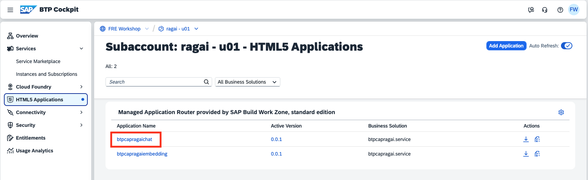
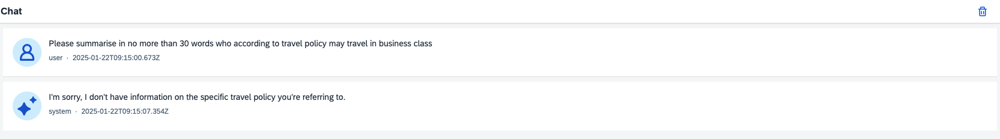
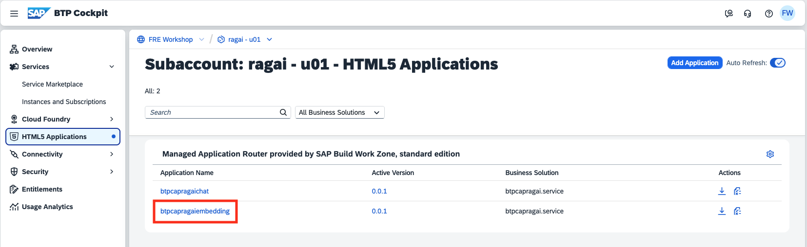
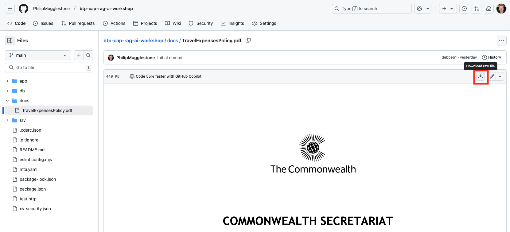
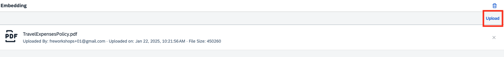
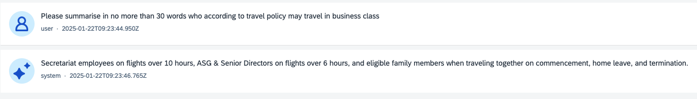
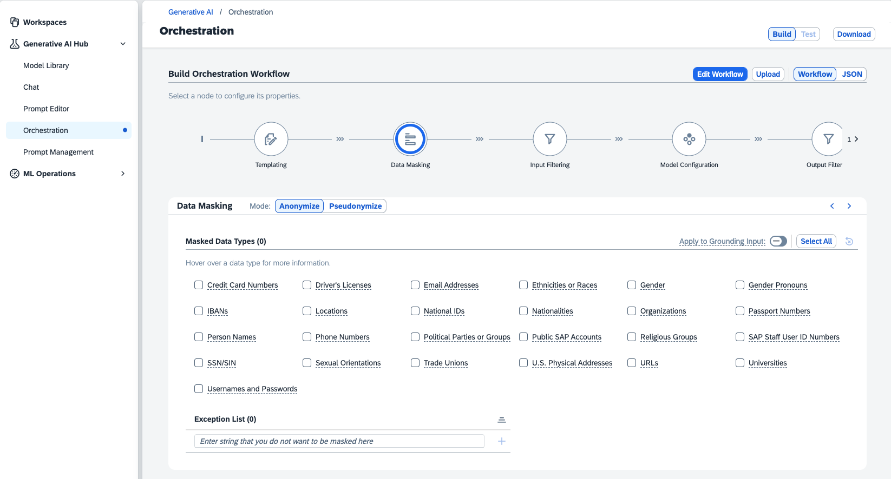

# Try the RAG Application

## Steps

1. From the HTML5 Applications menu, launch the Chat app by clicking on the link **btpcapragaichat**.



2. Click on **freworkshop.accounts.sap.com** to sign in.


3. Enter the following prompt in the field at the bottom of the window.
```
Please summarise in no more than 30 words who according to travel policy may travel in business class
```
You should receive a response explaining that the *chatbot* application doesn't have sufficient information to answer that.



4. From the HTML5 Applications menu, launch the Embedding app by clicking on the link **btpcapragaiembedding**.



5. Download the [Travel Expense Policy](https://github.com/PhilipMugglestone/btp-cap-rag-ai-workshop/blob/main/docs/TravelExpensesPolicy.pdf) document to your local machine using the **Download raw file** button.



6. Click **Upload** to upload the *Travel Expense Policy* document downloaded in the previous step. The upload is complete once the horizontal blue status bar is no longer visible.



7. Return to the chat app and re-enter the prompt.
```
Please summarise in no more than 30 words who according to travel policy may travel in business class
```
You should now receive a response guided by the document you just uploaded. The content of the document is being used to *ground* the foundation model and ensure only relevant responses are made.



8. You may have noticed that the chat application does not hallucinate. This is based on prompt engineering - take a look at **srv/chat-service.js** so see how this has been configured in the **getRagResponse** function. More sophisticated approaches can be developed and orchestrated using SAP Generative AI Hub including data masking and input/output filtering. 

```js
  const chatInstructionPrompt = `You are a chatbot.
  Answer the user question based only on the context, delimited by triple backticks.
  If you don't know the answer, just say that you don't know.`;
```



9. Try submitting further prompts from the examples below or come up with some by yourself.  

* What are the transport options?
* Tell me more about VISA requirements
* Explain the rest periods
* Can I get reimbursement for on-board internet expenses?
* Can I travel by train?

10. You might also upload your own document then enter prompts based on that.

11. Continue to the [next section](./05-ConfigureHybridDev.md).
