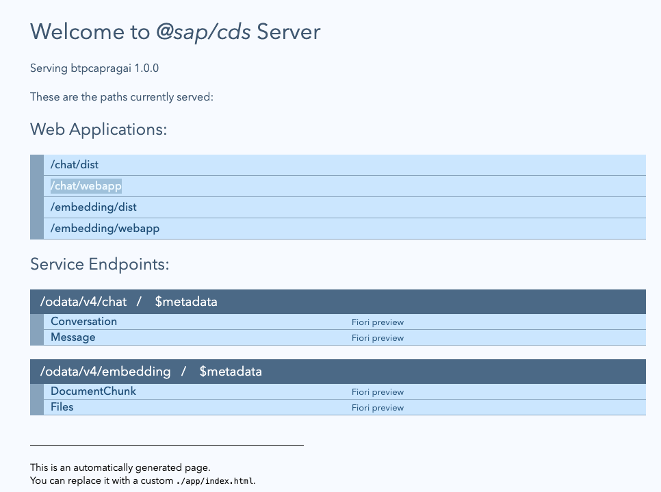
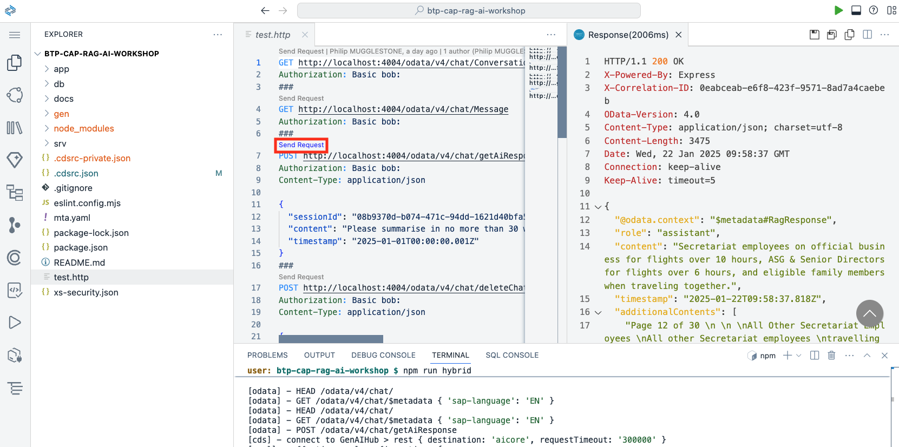

# Configure Hybrid Development

## Steps

1. We're now going to look at how we can customize and extend the RAG application. To make things easier let's first configure our SAP Build Code CAP project for hybrid development. From the Terminal pane enter the following commands. This will make it possible for the app to run locally yet still access Generative AI Hub and SAP HANA Cloud in SAP BTP. This means can easily develop and test without having to build and deploy to Cloud Foundry each time.

```
cds bind --to btpcapragai-destination
cds bind --to btpcapragai-db
```

2. Enter the following command to start hybrid development. Also, most code changes will be incorporated and can be tested in real time without having to restart. You can find out exactly what this command does in **package.json**.
```
npm run hybrid
```

3. From the CAP Welcome page that should open automatically - test the *chat/webapp* and *embedding/webapp* apps. When prompted to sign in specify **bob** as the user and leave the password empty. Use the **back** button on the browser to get back to the Welcome page.



4. You can also test the CAP entities and services using **test.http**.



5. Continue to the [next section](./06-AdaptSimilaritySearch.md).
