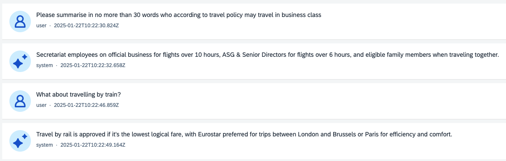
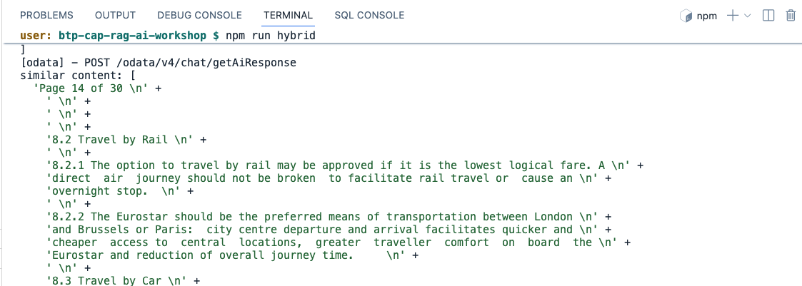

# Adapt Similarity Search

## Steps

1. From the project in SAP Build Code, review **srv/chat-service.js**. Find the following section in the **getRagResponse** function.

```js
  // perform similarity search
  const similarContent = await utils.similaritySearch(userQuery, 3, "COSINE_SIMILARITY", "DESC");
  //console.log("similar content:", similarContent);
```

2. While it is usually hard and computationally expensive to assess the similarity of two objects, it is easy and computationally relatively cheap to assess the similarity of two vectors. A similarity measure is a mathematical function that maps two vectors to a single number. Popular similarity measures are the L2 distance, which describes the distance of the vectors in Euclidean space, and Cosine Similarity describing the similarity in vector direction. Two similarity search functions are available with the SAP HANA Cloud Vector Engine.

* **COSINE_SIMILARITY**
* **L2DISTANCE**

3. Let's re-configure the app to use Euclidean space. Replace the code in **getRagResponse** with the following. Notice that we've changed the sort order to *ascending* as smaller values are likely to be more relevant using this approach. You could also uncomment the **console.log** statement in order to see more information in the log when the function is called.

```js
  // perform similarity search
  const similarContent = await utils.similaritySearch(userQuery, 3, "L2DISTANCE", "ASC");
  console.log("similar content:", similarContent);
```

4. If not already running from the previous section, start hybrid development.
```
npm run hybrid
```

5. Test the chat application and see what impact there is on prompt responses (if any).



6. If you uncommented the console.log statement you can also check the log in the Terminal pane.



7. Try changing the number of similarity search results to take into account and see what impact this has on responses in the chat (if any). For example, decrease the number from 3 to 1.

```js
  // perform similarity search
  const similarContent = await utils.similaritySearch(userQuery, 1, "L2DISTANCE", "ASC");
  console.log("similar content:", similarContent);
```

8. Continue to the [next section](./07-UseHANAEmbedding.md).
