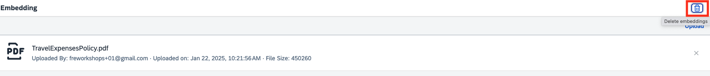
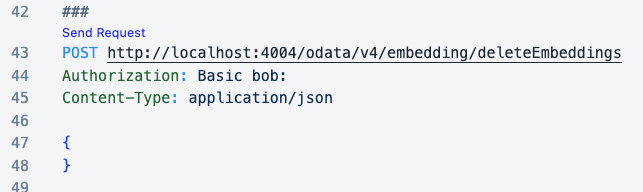
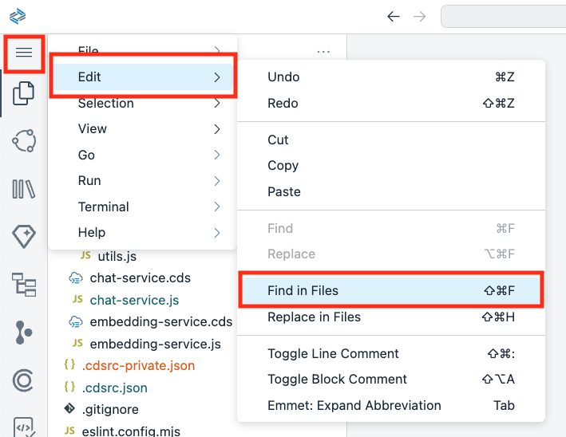
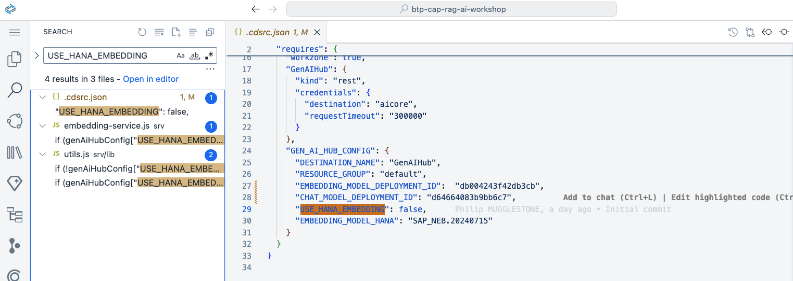
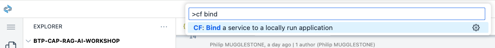
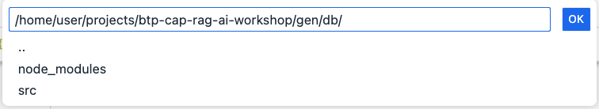
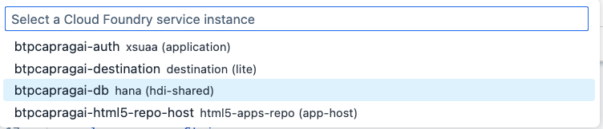

# Use Native SAP HANA Cloud Embedding

## Steps

1. We're going to change the *embedding* function from OpenAI to native SAP HANA Cloud. This involves changing the database Schema, so before we start let's remove all previously stored embeddings from the **DocumentChunk** entity. 

2a. You can do this by clicking on the trash can in the **Embeddings** app.



2b. Alternatively, you can also do this from **test.http**.



3. Enter **Control-C** in the Terminal pane to stop the hybrid development process.

4. Click the Hamburger (three vertical lines) icon in the left pane then select **Edit** then **Find in Files**. 



5. Search on **USE_HANA_EMBEDDING** and review the impacted code. Also note the **EMBEDDING_MODEL_HANA** setting. 

```
USE_HANA_EMBEDDING
```



6. In **.cdsrc.json** set the value to **true**

```json
"USE_HANA_EMBEDDING": true,
```

7. The native SAP HANA Cloud embedding model currently supports 768 dimensions so we'll need to change the **DocumentChunk** entity in **db/schema.cds** as follows. 

```js
    embedding       : Vector(768);
```

8. We now need to build and deploy to SAP HANA Cloud for the changes to take effect.

```
npm run build
```

9. Whilst you're waiting you might want to look at the [Reference Guide](https://help.sap.com/docs/hana-cloud-database/sap-hana-cloud-sap-hana-database-predictive-analysis-library/no-content-for-file-textembedding-md).

10. Once the build is complete, we need to deploy the changes. You can deploy the entire application as previously using **npm run deploy** but this will take some time. As we are using hybrid development we can save time by simply deploying the DB changes to SAP HANA Cloud. Click the Hamburger (three vertical lines) icon in the pane on the left then select **View** then **Command Palette...**. Then enter **cf** and select **Bind a service to a locally run application**. 



11. Select **gen** then **db** and press **OK**.



12. Select **btpcapragai-db hana (hdi-shared)**. This will take a few seconds.



13. From the Terminal pane change to the **gen/db** folder.

```
cd gen/db
```

14. Issue the following command to deploy the DB changes to SAP HANA Cloud.

```
npm run start -- --exit
```

15. Change back to the project root folder.

```
cd ../..
```

16. Start hybrid development

```
npm run hybrid
```

17. Test the embedding and chat applications and see what impact there is on prompt responses (if any).

18. Continue to the [next section](./08-ChangeChatModel.md).
