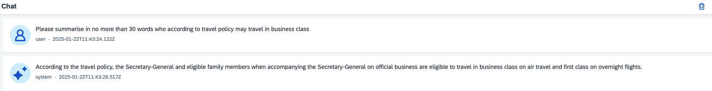

# Try a Different Chat Model

## Steps

1. We're now going to change the foundation model we use for chat completions from OpenAI to IBM Granite. You already know where to find deployment IDs in SAP AI Launchpad. Select **.cdsrc.json**. We need to paste the deployment ID for the chat model.
* **CHAT_MODEL_DEPLOYMENT_ID** paste the deployment ID for **ibm--granite-13b-chat** to replace **\_ID\_**
* **EMBEDDING_MODEL_DEPLOYMENT_ID** is not relevant this time as we're now embedding natively using SAP HANA Cloud

```json
    "GEN_AI_HUB_CONFIG": {
      "DESTINATION_NAME": "GenAIHub",
      "RESOURCE_GROUP": "default",
      "EMBEDDING_MODEL_DEPLOYMENT_ID": 	"_ID_",
      "CHAT_MODEL_DEPLOYMENT_ID": "_ID_",
      "USE_HANA_EMBEDDING": true,
      "EMBEDDING_MODEL_HANA": "SAP_NEB.20240715"
    }
```

2. Whilst Generative AI Hub makes it easy to access different foundation model, not all models use exactly the same syntax so some small changes will be needed. Select **srv/lib/utils.js** and find the **getChatResponse** function. IBM Granite doesn't need an **api-version** URL query parameter so this can be removed.


3. However it will be necessary to specify the model name in the message payload. Add the following line just before the line that sets **payload.max_tokens**. For more details on the exact specifications of each foundational model, see the link in the code to the [Reference Guide](https://help.sap.com/docs/sap-ai-core/sap-ai-core-service-guide/consume-generative-ai-models-using-sap-ai-core).

```js
payload.model = "ibm--granite-13b-chat";
```

4. You can also remove the following OpenAI centric configuration parameters and consider adding any that would be relevant for the IBM Granite model.

```js
payload.temperature = 0.0;
payload.frequency_penalty = 0;
payload.presence_penalty = 0;
```

5. Start hybrid development

```
npm run hybrid
```

6. Test the chat application and see what impact there is on responses to prompts. Here's a reminder of the prompt used previously.

```
Please summarise in no more than 30 words who according to travel policy may travel in business class
```



7. Continue to the [next section](./09-Teardown.md).
