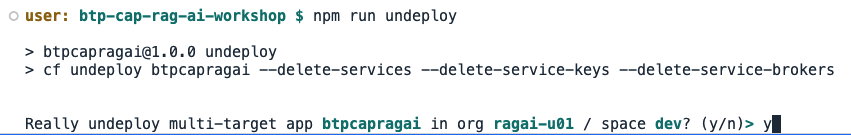

# Teardown

## Steps

1. Once you are finished with the hands-on please tear down the application that you deployed to SAP BTP.

2. Enter **Control-C** in the Terminal pane to stop the hybrid development process if it's still running.

3. Now undeploy the application from SAP BTP.

```
npm run undeploy
```

4. When prompted confirm by entering **y**.



5. It will take a few minutes to undeploy the application. 

6. Continue to the [next section](./10-BonusMaterial.md).
