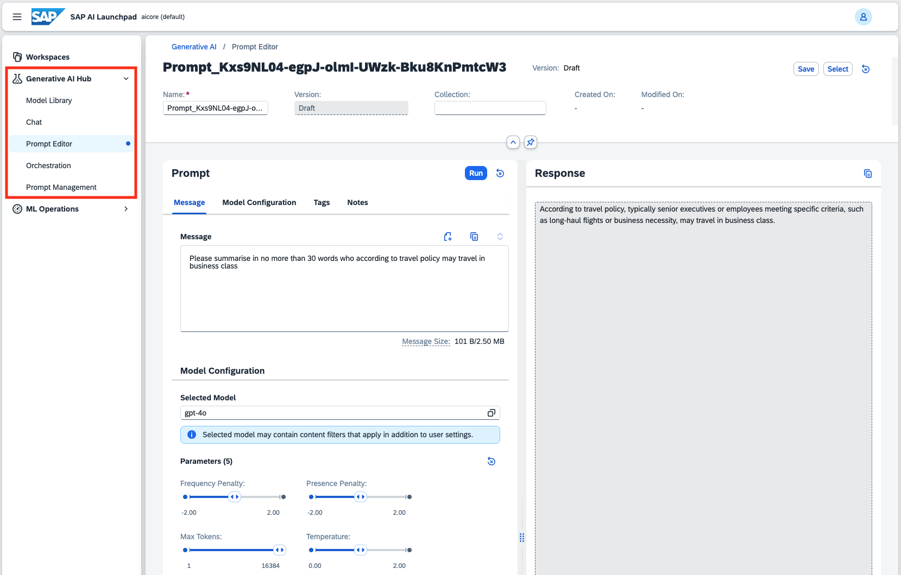
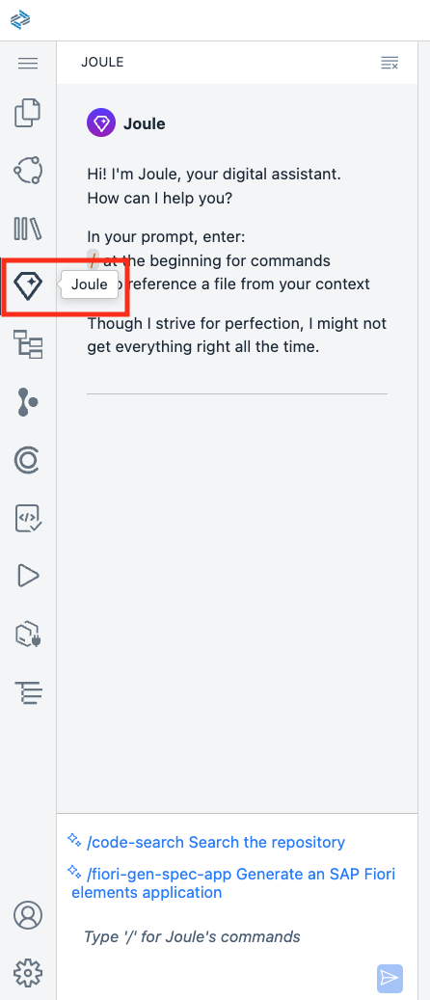
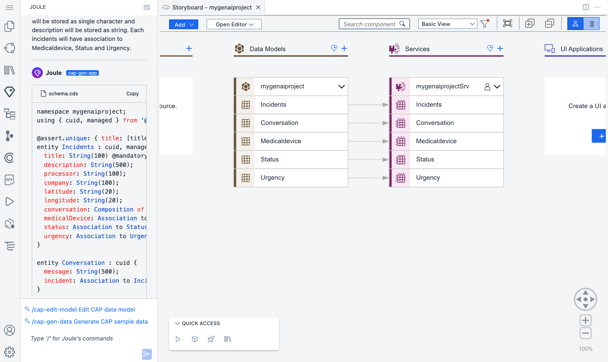

# Bonus Material

Once you have completed the hands-on and if you have some spare time left you might want to take a closer look Generative AI in SAP BTP in general.

## SAP AI Launchpad

We've already seen deployments in the hands-on. Consider experimenting with **Generative AI Hub** and in particular the following options.
* Model Library
* Chat
* Prompt Editor
* Orchestration
* Prompt Management



Further information can be found in the [User Guide](https://help.sap.com/docs/ai-launchpad/sap-ai-launchpad-user-guide/generative-ai-hub).

<p>

## Joule in SAP Build Code

Try creating a new project from the **SAP Build Lobby** and entering some prompts.



For example.

```
Generate a medical equipment maintenance application. Define data entities: Incidents, Medicaldevice, Conversation. There will be additional entities for Status and Urgency. Each Incident must have a title, description, creation date (createdAt), processor, company, latitude, longitude. All fields will be stored as String. Incidents will have composition relationship with Conversation. Conversation entity will have message which will be stored as string. Each Device should have code and description. All fields will be stored as string. Incident entity will have Status which will be a code list that includes the following fields: code, description and criticality. Code will be key and will be stored as single character, description will be stored as string and criticality will be stored as integer. Similarly Incident will have Urgency which will be a code list that includes the following fields: code, description. Code will be key and will be stored as single character and description will be stored as string. Each Incidents will have association to Medicaldevice, Status and Urgency. 
```



Further information can be found in the [Reference Guide](https://help.sap.com/docs/build_code/d0d8f5bfc3d640478854e6f4e7c7584a/758d28f15c044b43936230b258d1ebb7.html).

Back to [Overview](./README.md).
